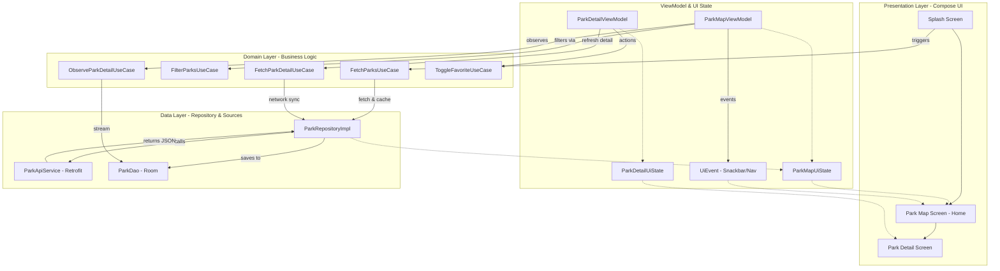

# Park🅿️

Discover available ISPARK parking spots, check real-time fees, and navigate to your destination with ease.

## 📱 App Showcase
<div style="text-align: center;">
  <table>
      <td><b>1. Splash & Pre-fetch</b></td>
      <td><b>2. Map & Pager Sync</b></td>
      <td><b>3. Detail & Navigation</b></td>
    </tr>
    <tr>
      <td>
       
      </td>
      <td>
       
      </td>
      <td>
       
      </td>
    </tr>
  </table>
</div>

## 🛠 Tech Stack
- **Jetpack Compose** – 100% declarative UI with Material 3 and Dynamic Color support.
- **Navigation Compose** – Type-safe routing using Kotlin Serialization.
- **Dagger-Hilt** – Dependency Injection with modularized providers.
- **Room** – Local persistence for **Offline-First** capability and Single Source of Truth (SSoT).
- **Retrofit + OkHttp** – Network layer with custom Call Adapters for automatic `Resource<T>` wrapping.
- **Google Maps Compose** – Interactive map with custom JSON styles and geospatial polygon overlays.
- **Coroutines & Flow** – Reactive data streams with an **MVVM/MVI hybrid approach** (StateFlow + Channels).
- **Clean Architecture** – Strictly decoupled layers (Data, Domain, Presentation) with single-responsibility UseCases.
- **Offline Resilience** – Resilient recovery with intelligent data pre-fetching and localized error handling.
- **Multi-Language Support** – Fully localized in English and Turkish using a custom `UiText` wrapper.

## 📦 Project Architecture & Flow
The project follows **Clean Architecture** principles with a strict separation of concerns. Below is the high-level data flow and architectural diagram:



### Folder Structure
```
com.brkckr.parkv2/
├── data/
│   ├── local/          # Room DB, DAO, Entities (Offline Storage)
│   ├── remote/         # Retrofit API, Response models, Call Adapters
│   ├── mapper/         # Data ↔ Domain Layer conversion
│   └── repository/     # Repository Implementations (SSoT Logic)
├── domain/
│   ├── model/          # Clean Data Classes (Park, ParkDetail)
│   ├── repository/     # Domain interfaces
│   └── usecase/        # Single-responsibility Business Logic
├── presentation/
│   ├── splash/         # Onboarding & Initial Sync
│   ├── park_map/       # Map UI, Horizontal Pager, Search
│   ├── park_detail/    # Park Details & Polygon display
│   ├── navigation/     # Type-safe Route definitions
│   └── common/         # UiEvent, UiText, Shared UI Logic
├── di/                 # Decoupled Hilt Modules
└── ui/
    ├── theme/          # Material 3 Theme & Dynamic Colors
    └── components/     # Global Reusable UI Components (Chips, Loaders)
```

## ⚙️ Setup
1. Add your **Google Maps API Key** to `local.defaults.properties` in the root directory.
2. Open the project in **Android Studio** and click **Run**## ⚙️ Installation & Setup


